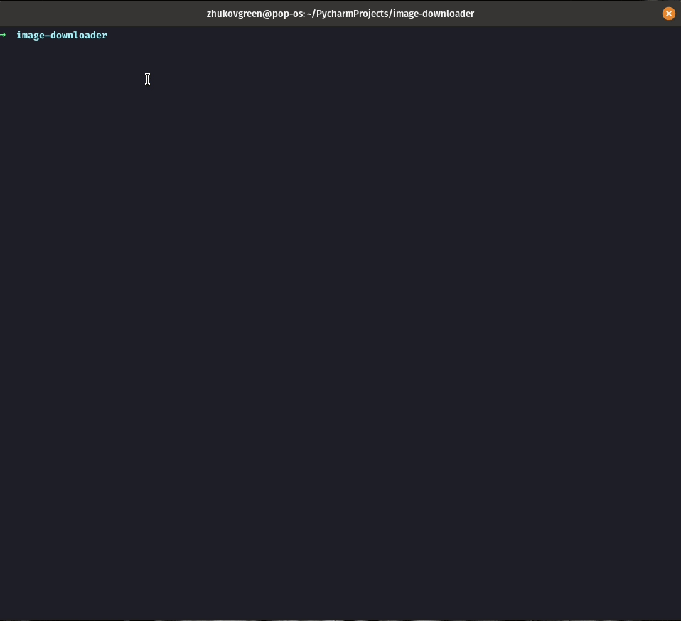

# Image downloader

```
  Usage: image-dl [OPTIONS] SRC TARGET
  Tool which downloads all images and store them in a given dir.

  As input expected a plain-text file, where each line has a URL with the
  image.

Options:
  -v, --verbose  Verbosity of the tool
  --help         Show this message and exit.
```

# Demo


# Development environment
- poetry install
- poetry run pytest

# TODOs

The code is not taking advantage on asynchronicity unless we wont spin up
a new task there. However it is possible to make the code more parallel, where
it is expected to get a speed bonus.

Split up the file reading, URL downloading and file writing into three
distinct parts (each runs in a separate tasks). Since this is a highly
intensive IO tasks a productivity will be boosted. Example shown, for example
here:
<https://github.com/ZhukovGreen/bouquets_generator/blob/master/bouquets_generator/__init__.py#L115-L130>
